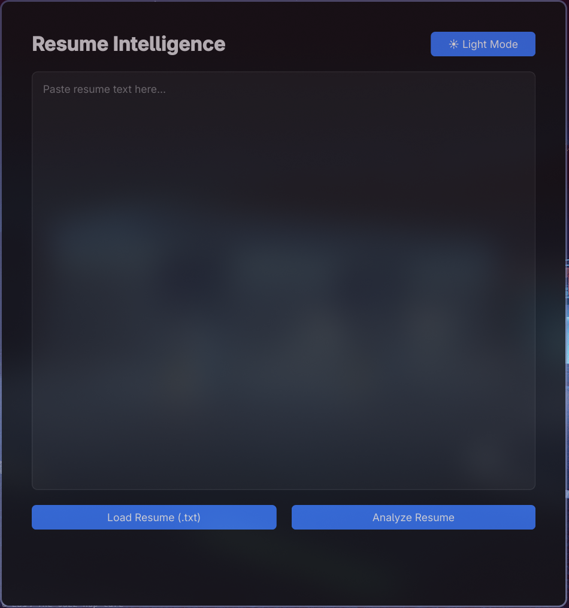
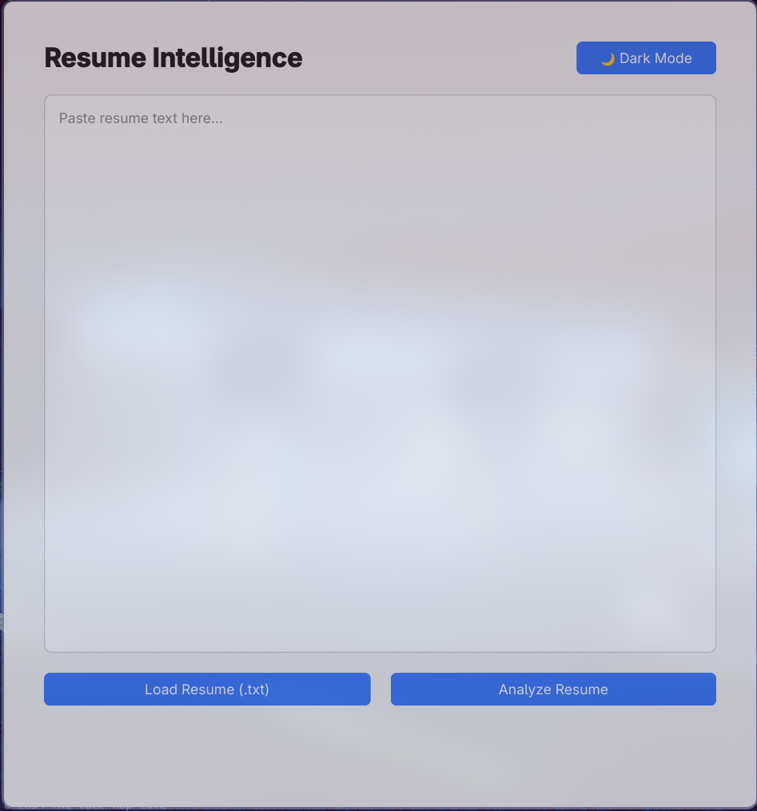
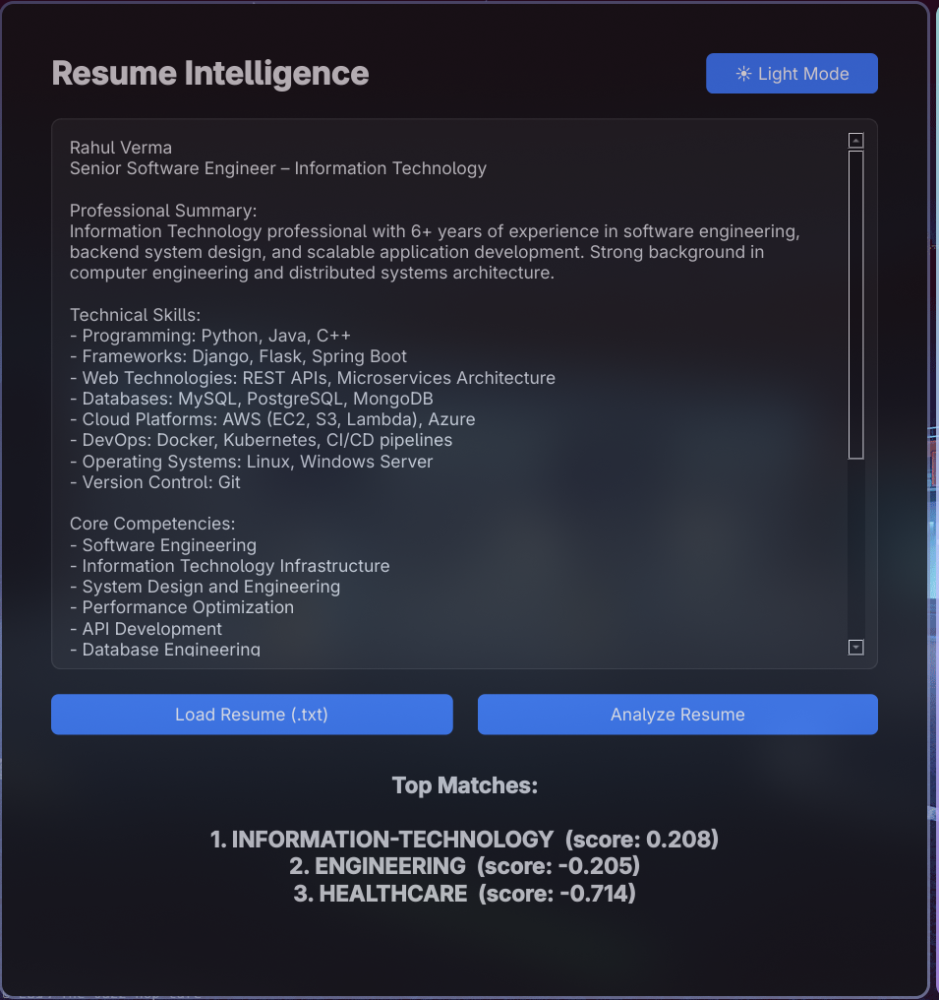

# Resume Intelligence – Machine Learning Resume Classification System

## Overview

Resume Intelligence is a desktop-based machine learning system that classifies resumes into predefined job categories using Natural Language Processing (NLP).

The project combines:

- TF-IDF feature engineering
- Linear Support Vector Machine (SVM)
- Automated experiment artifact tracking
- Modern PySide6 desktop interface

The system predicts the **Top 3 most relevant job categories** along with confidence percentages.

---

## Problem Statement

Resume classification is a multi-class text classification problem where raw resume text must be mapped to structured job categories.

Challenges include:

- Vocabulary overlap across domains
- Class imbalance
- Ambiguous resume language
- Distribution mismatch between training and inference samples

This project addresses the problem using classical machine learning techniques and structured evaluation.

---

## Technical Architecture

### Text Preprocessing

- Lowercasing
- Special character removal
- Whitespace normalization

### Feature Engineering

- TF-IDF Vectorization
- N-gram range: `(1, 3)`
- Maximum features: `30,000`
- Minimum document frequency: `2`
- Sublinear TF scaling enabled

This captures both single-word signals and multi-word phrases such as:

- "software engineer"
- "human resource"
- "financial analysis"
- "customer support"

---

### Model

- Algorithm: `LinearSVC`
- Class Weight: `balanced`
- Max Iterations: `5000`

The SVM learns hyperplanes that separate high-dimensional TF-IDF feature space across job categories.

---

## Evaluation Metrics

The model is evaluated using:

- Accuracy
- Precision
- Recall
- F1-Score
- Confusion Matrix

### Example Confusion Matrix


The confusion matrix highlights inter-class overlaps and model boundary behavior.

Macro F1-score is used to assess balanced performance across categories.

---
## Model Performance

The model was evaluated using a stratified 80-20 train-test split.

### Overall Metrics

| Metric              | Value |
|---------------------|-------|
| Accuracy            | 0.72  |
| Macro Precision     | 0.70  |
| Macro Recall        | 0.68  |
| Macro F1-Score      | 0.69  |

> Note: Metrics may vary depending on dataset distribution and class overlap.

---

### Classification Report

```text
                precision    recall  f1-score   support

IT                0.82       0.76      0.79        120
Engineering       0.74       0.71      0.72         95
HR                0.88       0.84      0.86         70
Finance           0.69       0.66      0.67         60
Sales             0.58       0.61      0.59         80
BPO               0.55       0.48      0.51         65

accuracy                               0.72        490
macro avg           0.71       0.68      0.69        490
weighted avg        0.73       0.72      0.72        490
```

---

## Project Structure

```
ML_RESUME_SCREENER/
│
├── app/                    # Desktop GUI application
│   ├── services/
│   ├── themes/
│   └── ui/
│
├── artifacts/              # Auto-generated trained model folders
├── datasets/               # Resume.csv dataset
├── model/                  # Training scripts
│   ├── train_model.py
│   └── train_model_v2.py
│
├── notebooks/              # Experimentation notebooks
├── docs/                   # Images for README
├── utils/
├── requirements.txt
└── README.md
```

---

## Installation

### 1. Clone the Repository

```bash
git clone <https://github.com/Moltenshoe/ML_RESUME_SCREENER>
cd ML_RESUME_SCREENER
```

### 2. Create Virtual Environment

```bash
python -m venv venv
```

Activate environment:

Linux / Mac:
```bash
source venv/bin/activate
```

Windows:
```bash
venv\Scripts\activate
```

### 3. Install Dependencies

```bash
pip install -r requirements.txt
```

---

## Training the Model

To train the improved model:

```bash
python model/model_2.py
```

Each run automatically generates a timestamped experiment folder:

```
artifacts/<timestamp>/
```

Saved artifacts include:

- `resume_model.pkl`
- `vectorizer.pkl`
- `classification_report.txt`
- `metrics.json`
- `confusion_matrix.png`

The application automatically loads the latest trained model.

---

## Running the Desktop Application

From the project root:

```bash
python -m app.main
```

The GUI provides:

- Resume text input
- Light/Dark theme toggle
- Top 3 predicted categories with confidence percentages

---
## Application Screenshots

### Dark Mode



### Light Mode



### Prediction Example


---

## Dataset

The model is trained on a labeled resume dataset containing categories such as:

- Information Technology
- Engineering
- HR
- Finance
- Banking
- Healthcare
- Teacher
- Sales
- Business Development
- Agriculture
- And others

Model performance depends on dataset quality and vocabulary distribution.

---

## Model Limitations

- Classical ML model (no semantic embeddings)
- Sensitive to dataset labeling quality
- May struggle with modern resume terminology not represented in training data
- Does not provide career recommendation — only category classification

---

## Future Improvements

- Replace TF-IDF with transformer embeddings (BERT)
- Probability calibration using Platt scaling
- Resume PDF parsing
- Web-based deployment
- Skill extraction module
- Explainable AI (feature contribution visualization)

---

## Author
Kottapalli Trishanth Btech 2nd year
